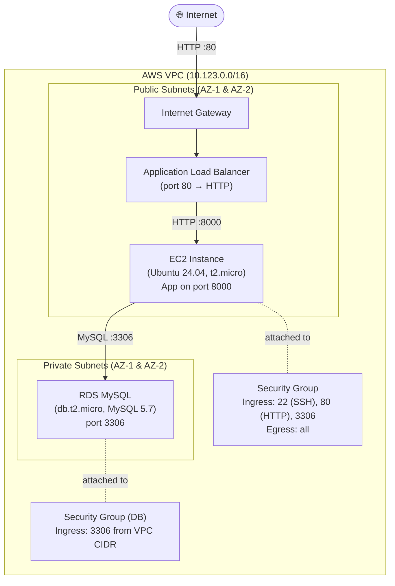

# terraform-aws

Terraform project that provisions a production-style AWS infrastructure using modular code. The infrastructure is managed via [Terraform Cloud](https://app.terraform.io/) (organization: `FSTT`, workspace: `aws`).

---

## Architecture



### Traffic flow

1. **Users** hit the **Application Load Balancer** on port 80 via the Internet Gateway.
2. The ALB forwards traffic to one or more **EC2 instances** on port 8000 using a target group with HTTP health checks.
3. EC2 instances connect to the **MySQL RDS** instance on port 3306 inside the private subnets using credentials injected via user-data.

---

## Modules

| Module | Source | Description |
|--------|--------|-------------|
| `networking` | `./networking` | VPC, public/private subnets, IGW, route tables, security groups, DB subnet group |
| `datbase` | `./database` | MySQL RDS instance (db.t2.micro) |
| `loadbalancing` | `./loadbalacing` | ALB, target group (port 8000), HTTP listener (port 80) |
| `compute` | `./compute` | EC2 instances (Ubuntu 24.04), SSH key pair, target group attachments |

---

## Infrastructure details

### Networking

| Resource | Details |
|----------|---------|
| VPC CIDR | `10.123.0.0/16` |
| Public subnets | 2 subnets across random AZs, auto-assign public IP |
| Private subnets | 2 subnets across random AZs, no public IP |
| Internet Gateway | Attached to VPC |
| Route table | Public RT routes `0.0.0.0/0` → IGW |
| Security Group | SSH (22), HTTP (80), MySQL (3306) ingress; all egress |
| DB Subnet Group | Created from private subnets |

### Compute

| Resource | Details |
|----------|---------|
| AMI | Ubuntu 24.04 LTS (latest, `099720109477`) |
| Instance type | `t2.micro` |
| Root volume | 8 GB |
| Key pair | `myterra-key` (loaded from `id_rsa.pub`) |
| User data | `userdata.tpl` — bootstraps app with DB credentials |
| Instance count | 1 (configurable) |

### Load Balancer

| Resource | Details |
|----------|---------|
| Type | Application Load Balancer (ALB) |
| Listener | HTTP port 80 |
| Target group | HTTP port 8000 |
| Health check | Interval 20s, timeout 3s, healthy threshold 2, unhealthy threshold 2 |
| Idle timeout | 400s |

### Database

| Resource | Details |
|----------|---------|
| Engine | MySQL 5.7.22 |
| Instance class | `db.t2.micro` |
| Storage | 10 GB |
| Identifier | `myterra-db` |
| Subnet group | Private subnets |
| Final snapshot | Skipped |

---

## Prerequisites

- [Terraform](https://developer.hashicorp.com/terraform/downloads) >= 1.0
- [AWS CLI](https://docs.aws.amazon.com/cli/latest/userguide/install-cliv2.html) configured with appropriate credentials
- A Terraform Cloud account (organization `FSTT`, workspace `aws`)
- An SSH public key at `./id_rsa.pub` (used to create the `myterra-key` key pair)

---

## Variables

| Variable | Type | Sensitive | Description |
|----------|------|-----------|-------------|
| `aws_region` | string | No | AWS region (default: `us-east-1`) |
| `access_ip` | string | No | Your IP CIDR allowed for SSH/HTTP access (e.g. `1.2.3.4/32`) |
| `db_user` | string | **Yes** | RDS master username |
| `db_name` | string | **Yes** | RDS database name |
| `db_password` | string | **Yes** | RDS master password |

Set sensitive values in `terraform.tfvars` (never commit this file) or via Terraform Cloud workspace variables.

Example `terraform.tfvars`:
```hcl
access_ip   = "YOUR_IP/32"
db_user     = "admin"
db_name     = "appdb"
db_password = "changeme"
```

---

## Usage

```bash
# Authenticate with Terraform Cloud
terraform login

# Initialise providers and backend
terraform init

# Review the plan
terraform plan

# Apply the infrastructure
terraform apply

# Tear it all down
terraform destroy
```

---

## Outputs

| Output | Sensitive | Description |
|--------|-----------|-------------|
| `lb_endpoint` | No | DNS name of the Application Load Balancer |
| `instaces` | **Yes** | Map of instance name → public IP for all EC2 nodes |
